# StarWars Episode 1: Racer Multiplayer Fan Game

## Description

This is a personal project that I have been working on for several months as a solo developer. I was inspired by the classic `Star Wars Episode I: Racer` game from 1999 and wanted to be able to play it with better graphics, visuals. I came across RobJin's fantastic work and wanted to try and make it myself. The result is a multiplayer game that allows up to 4 people to race on LAN, and as of now there is a simplified version of the `Mos Espa Tatooine` map. You can play as Anakin in his podracer with 4 different coloured skins available for multiplayer. 

My game includes sound effects and soundtracks. It also supports joystick controllers in addition to a keyboard.

Modeling, texturing, rigging and animation was done in `Autodesk Maya`. The programming, effects, and the game itself was made in `Unreal Engine 4`.

Here is a short gif of the final product. Please watch the [full Youtube Video](https://www.youtube.com/watch?v=9dATwSaVTCg)!

### - [Youtube Video](https://www.youtube.com/watch?v=9dATwSaVTCg)
### - [Game Download (MEGA)](https://mega.nz/file/ghclTYpQ#OW57o3GzZr-_kXqgvXCZOKP-XuNZJzQukDkgMI9lAWI) OR download the game from the releases page of this repository
### - More screenshots available on my [Artstation page](https://www.artstation.com/artwork/Ga5x01)

While making this Game, I learnt a great deal about:
- vectors, acceleration curves, and damping physics required to make the hover mechanism
- networking and client/server architectures to allow low-latency multiplayer gameplay
- modelling, texturing, rigging, and animating assets for the game using `Autodesk Maya`
- designing a user friendly GUI for navigating game settings and live heads up display in-race

## Notes
While the full game is available as a download, the only code available in this repository is a Hover Car Demo I made using Unreal Engine 4.
- Use arrow keys to drive. 
- It has realistic hover physics that allow you to "float" and move around.
- Compilied version of this demo is also available in releases page of this repository.
- A gif this demo can be found  by looking at point #5 in [The Making of the Game](#the-making-of-the-game)

## Screenshots
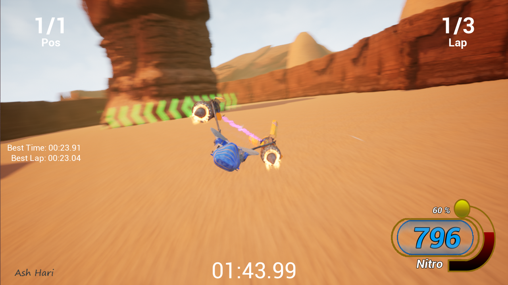
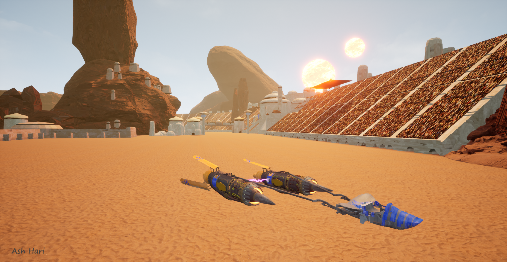
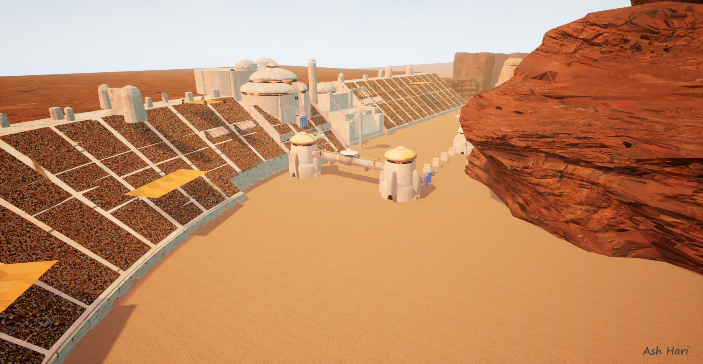

## The Making of the Game

1. I first started with the basic third person template in Unreal Engine.

2. Then I followed some tutorials ([Hover Tutorial 1](https://www.youtube.com/watch?v=cPVaDndT7tY) and [Hover Tutorial 2](https://www.youtube.com/watch?v=ko6lDSSNhV8)) on how to create the hover physics that was needed for my game. This uses damping and force vectors, and I continuously fine-tuned the physics as I worked on this project so that the gameplay had a nice feel to it. The 4 red lines under the hover "block" are a visualization of the hover forces that are being applied.               

3. Next I imported a hover car model that I found online (on [TurboSquid](https://www.turbosquid.com)) and replaced the rectangular block with the new hover car.    

4. I then added acceleration curves and got the car to accelerate and deaccelerate. At first, I had a curve like the picture below. This curve is like the 1999 Star Wars Racer game, where the pod would intially accelerate all of a sudden:                                
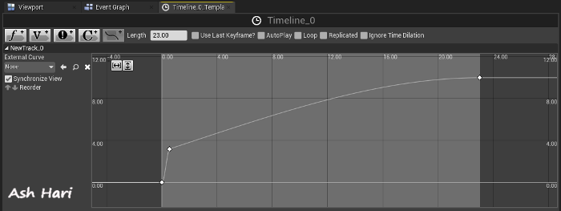
- I later on decided to change to a curve like this one below as it felt more realistic and models [vehicle motion control profiles in real life](https://www.linearmotiontips.com/how-to-reduce-jerk-in-linear-motion-systems/):
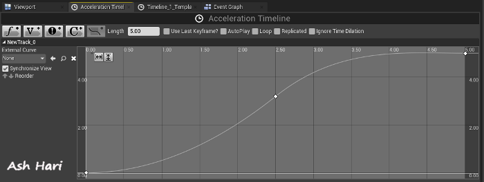
- Code Snippet for applying the acceleration curve
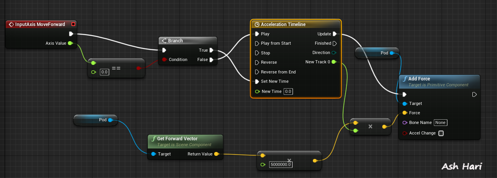

5. Then I add some test scenery to the game using real-life canyon assets from [Quixel](https://quixel.com/). I also impemented collision detection between the hovercar and the canyons.

- Below is a screenshot showing all the surfaces on a single canyon block (blue lines show the edges of surfaces):
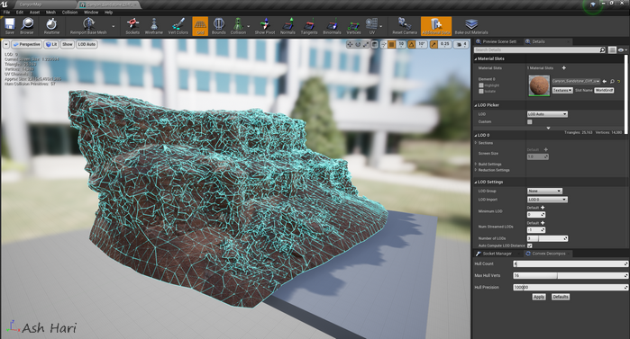
- Code Snippet: Collision detection and action of pod when it hits another object:
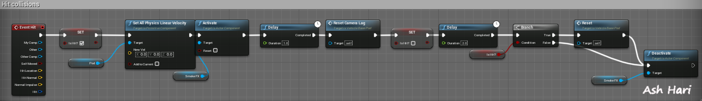

6. The next thing to do was to replace the hover car with a Pod Racer model. After looking for a Pod Racer model online, I found one on [Sci-Fi 3D](http://www.scifi3d.com/), and attempted to import it into Unreal Engine. I found that there were a lot fixes needed to be made to the pod - the pod was not textured properly and the model had many surface defects. Regardless, it was a great and very helpful starting point!              
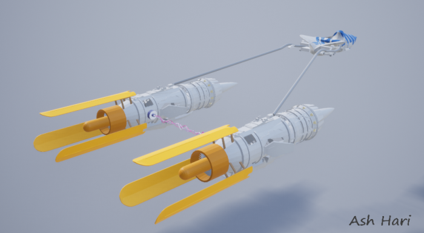

7. The next thing I did was remodeling, and retexturing the Pod Racer in Autodesk Maya. I also rigged and animated the pod so that it came to life! I made animations for moving thrusters, independant engine motion and ailerons, and the tilt animation. I got the idea of having the tilt be an animation from this [video](https://www.youtube.com/watch?v=LYqc1cEYIE0)). Below is a gif of the animations being played in Autodesk Maya. The green and blue lines on the pod is a visualization of the bone structure I made for the rigging and animating:                       
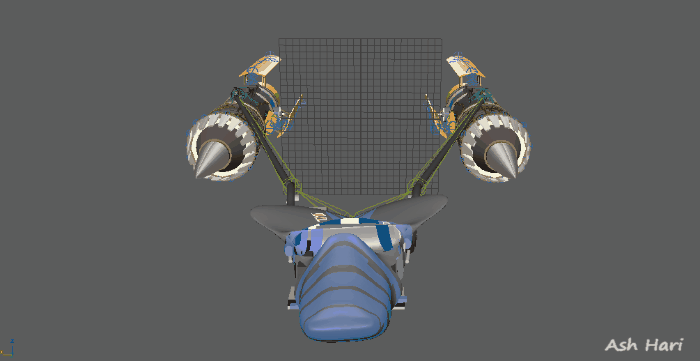
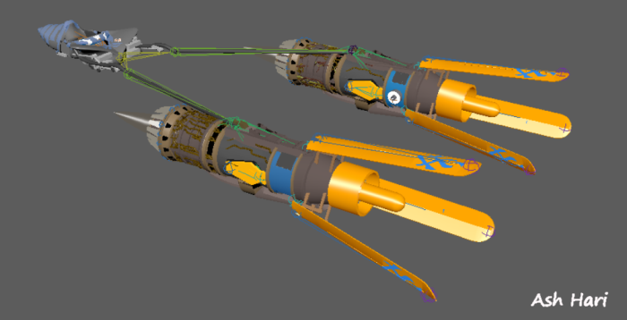
- I also added metal and dirt textures later on to make it look more realistic:                  
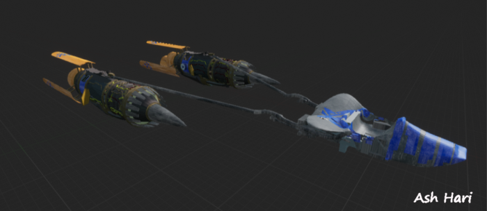

8. I imported the updated model with the animations into Unreal Engine as a skeletal mesh. The tilting animation of the pod when turning, was not such a simple task. Keyboard key-presses are digital values, where as turning with a joystick gives an analog value. Since the aim was to play this game with a joystick, the pod needed to tilt smoothly based on the analog joystick angle. I consulted [Rob Jin](https://www.artstation.com/artwork/QznP58) for advice regarding the hover physics when tilting & turning.
    
    Below is the `Blendspace` I made in Unreal Engine, which shows what happens when for a range of the joystick's analog values:

9. After that, I created the famed pink laser beams (energy binders) that connects the 2 pod engines using `Niagara` Particle Effects. `Niagara` is built into Unreal Engine and is a particle generator used for visual effects. The glowing engine fire is also created through `Niagara` particle effects.
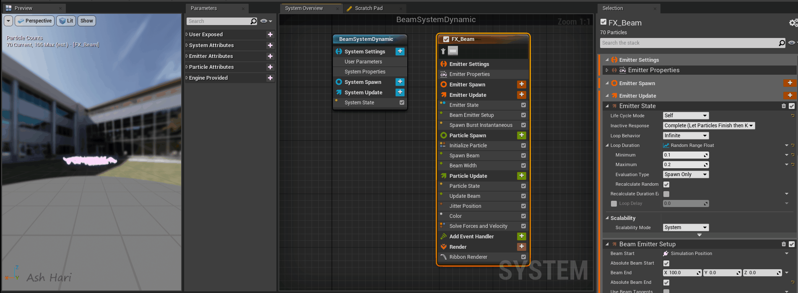
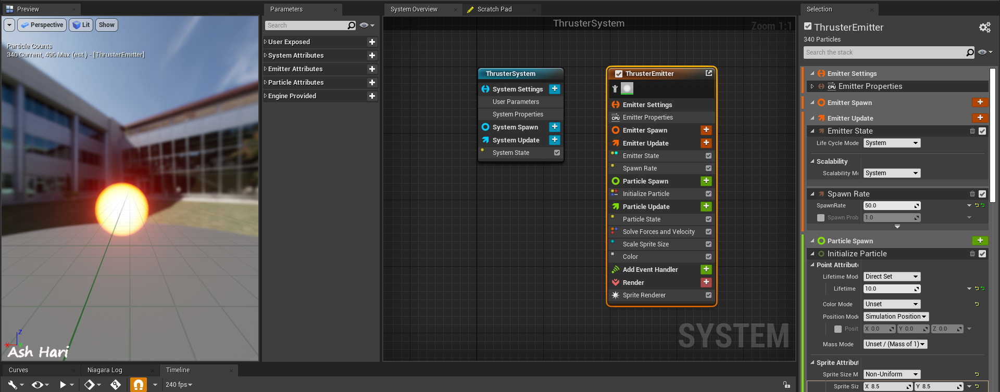

10. The next thing to do was to add boost/Nitro. I added in a Nitro System that refills as you race based on [this nitro tutorial](https://www.youtube.comnwatch?v=XFrsQmRJEOE), and exhaust flames that come out of the pod engine while boosting. I also made a camera-lag system, where the camera provides a broader view of the surroundings as the player accelrates, to give the impression that the pod is going even faster. 
Below is a code snippet for the nitro system:
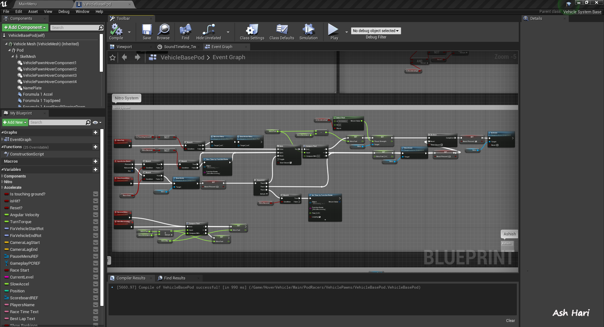

11. One of the main purposes of this project, was to be able to race in multiplayer with updated graphics. So after adding in more scenery, the Pod Racing Arena, and things like creating textured suns for Tatooine, I found this [great multiplayer tutorial series](https://www.youtube.com/watch?v=Vw3d9Kwd6v8&list=PLM5xJtuLgIuz1NQcei5lE09TY5M4CMOwA&index=2) to learn about multiplayer in Unreal Engine and how it works.  
    
    However, in the tutorial series, all physics computations were run server-side. This led to a lot of lag in my fast-paced game. Ideally, I wanted the physics to be run client-side which would allow for low-latency gameplay as one Computer would not be taking all the load. 
    
    I took some additional time to dive deep into client / server interactions and how `Replication` works. The result was that I was finally able to get the all players to see each other and move around lag-free, with physics run client-side.

    
- Code snippet: Replicating position and rotation for multiplayer:
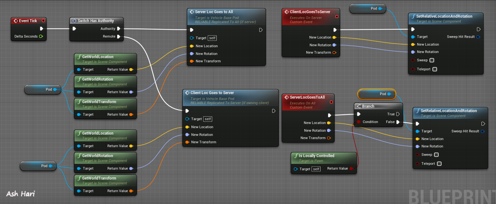
- I also implemented nametags so that racers are able to see which racer is racing which pod. (heavily adapted from this [nametag tutorial](https://www.youtube.com/watch?v=IK31q8H2Y2M)):

12. In parallel, I also added a menu system, where you are able to host and find a match, and change game settings. After creating/joining the session, there is a lobby where the players can pick their multiplayer race settings. In-game, there is a pause menu where you can see controls, change game settings, and quit.
- Main menu:             
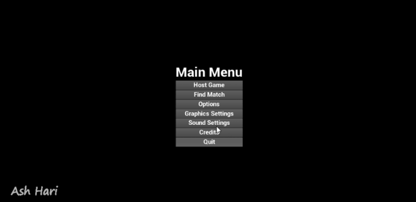
- Lobby:           

- Pause Menu:             
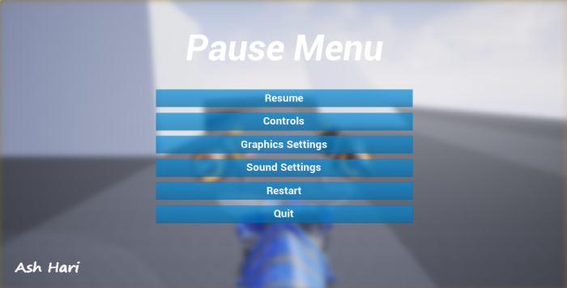

13. Any game is incomplete without sound-effects and a soundtrack. I wanted the Pod Racer to have engine and acceleration sounds so I took parts from different videos, e.g. [this](https://www.youtube.com/watch?v=CJMfjzQ2lcs), lowered the pitch so that is sounded more like large jet engines, and set them up to play at the appropriate times. Other sound effects also followed a similiar implementation procedure. Below is a code snippet for fading in the "top-speed" sound when the pod has reached its top speed:
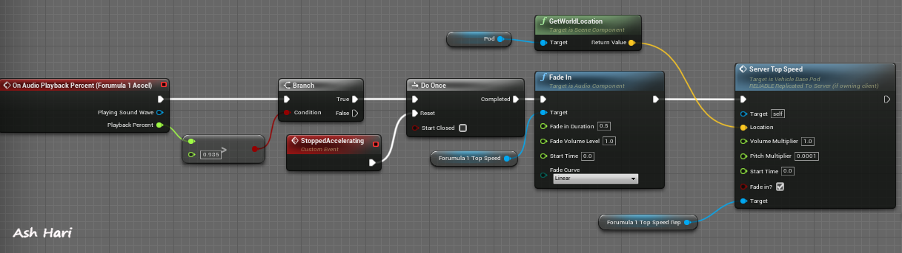
- Code snippet: Replicating the sound of your pod (using server-client programming) to the other players so that they are able to hear you and you can hear them when nearby:
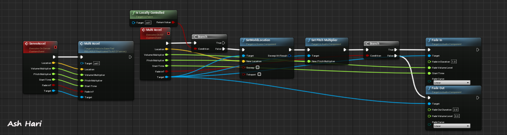

14. The last piece of the project was creating the race mechanics like laps, timer, and checkpoints. I found this [racing gamemode tutorial series](https://www.youtube.com/watch?v=VJj6rQpktyI&list=PLZlv_N0_O1gYdhCvvMKGpCF6LCgBz9XeS) which was really helpful and allowed me to create the game mode I needed. I had to update many details to get it working with multiplayer as the tutorial was only meant for a single player. Below is a code snippet of the lap and race timer code which is used during the race:                     
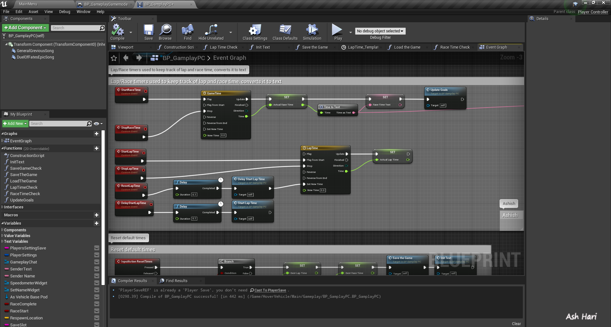
- Another feature I added during this time was Heads Up Display (HUD). The HUD is displayed on screen during the race to show a timer, the players position, lap number, and the best race time. I also added a custom speedometer (that mimics the original Pod Racing game), and a Nitro bar. Below is a desgin layout of the in-game HUD: 
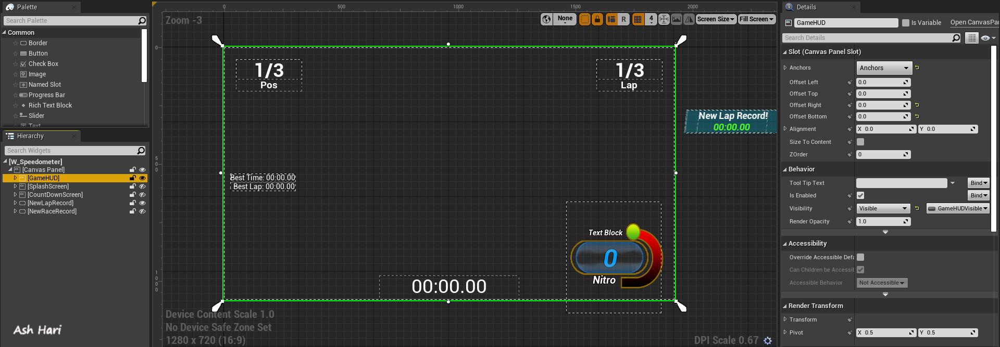
- I also added in a positioning system, where you can tell what place you are in live in-game. Below is a code snippet for getting the player's "position" based on how many players have passed a certain checkpoint in the game:
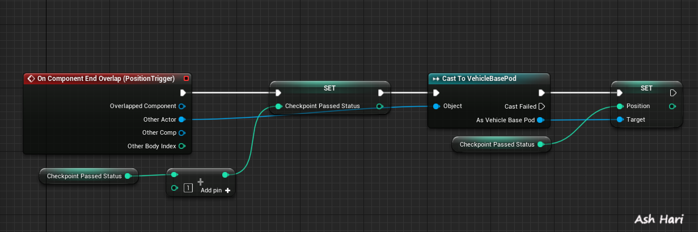
- A ranking system was also put into place so the player is able to see who is in what position live in-game (modified a lot from [this tutorial](https://www.youtube.com/watch?v=frpBJ_R4CmY)). 
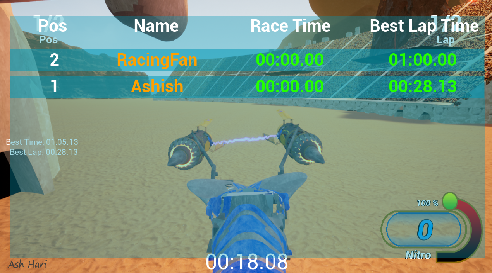

15. Here is a short gif of the final product:
    

- [Youtube Video](https://www.youtube.com/watch?v=9dATwSaVTCg)
- [Game Download (MEGA)](https://mega.nz/file/ghclTYpQ#OW57o3GzZr-_kXqgvXCZOKP-XuNZJzQukDkgMI9lAWI) OR download the game from the releases page of this repository
- More screenshots available on my [Artstation page](https://www.artstation.com/artwork/Ga5x01)

## Copyright Disclaimer:

    THE CONTENT IS FOR ENTERTAINMENT PURPOSE ONLY. IT IS NOT FOR SALE OR MONETIZATION. IT IS NOT ASSOCIATED OR ENDORSED BY DISNEY, LUCASFILM, OR ANY OTHER AFFILIATED COMPANIES. ALL CHARACTERS, NAMES, AND REFERENCES ARE COPYRIGHT AND TRADEMARK OF THEIR RESPECTIVE HOLDERS.
